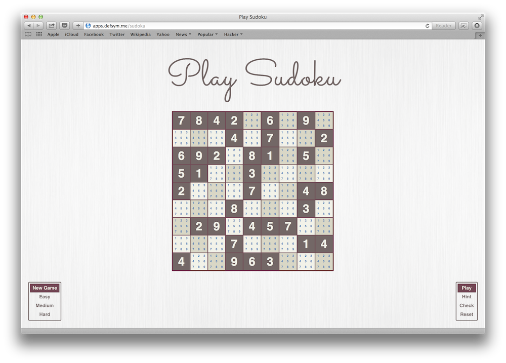

# sudoku

A very simple browser based Sudoku game written in Clojure and jQuery

## Usage

1. Install [leiningen][1]  
2. Clone this repository, and from the base directory run: lein ring server-headless  
3. Open up a browser and navigate to [http://localhost:3000/][2]  

## Screenshot

## Try it online
[http://apps.defsym.me/sudoku][3]

[1]: https://github.com/technomancy/leiningen
[2]: http://localhost:3000/
[3]: http://apps.defsym.me/sudoku

## License

Copyright © 2013 Sankaranarayanan Viswanathan

Distributed under the Eclipse Public License, the same as Clojure.
